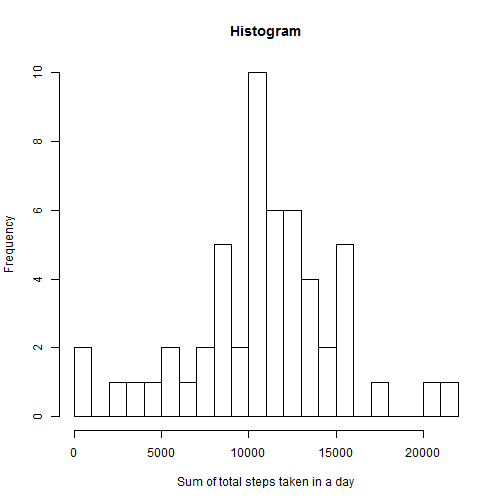
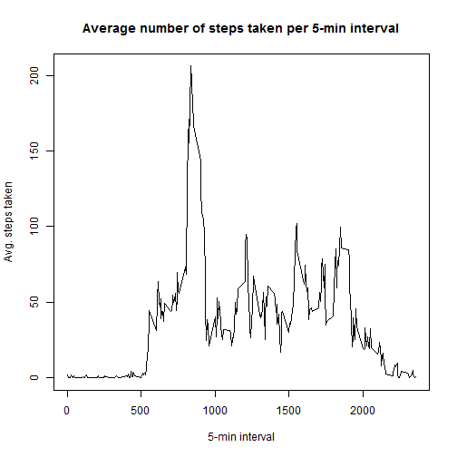
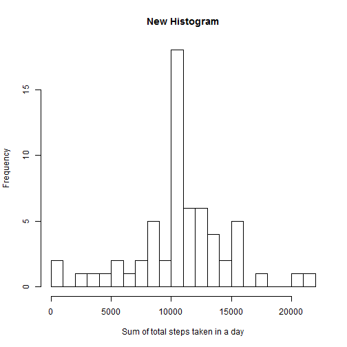
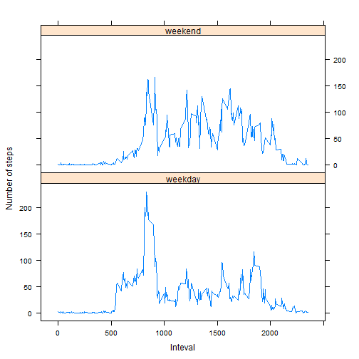

# Reproducible Research: Peer Assessment 1


## Loading and preprocessing the data

1. Per Prof. Peng's note, "The GitHub repository also contains the dataset for the assignment so you do not have to download the data separately."  Thus, there is no code, here, to download the data.

    First, set the working directory, then read in the data using `read.csv()`, which uses `header = TRUE` and `sep = ","` as appropriate defaults.  

2. In case it might help, process/transform the "date" column data so its class == `"Date"`.


```r
setwd("C:/Users/Daniel/Desktop/Coursera/Data Science")

data <- read.csv("activity.csv") ## data$date reads in as class == "Factor"

str(data) 
```

```
## 'data.frame':	17568 obs. of  3 variables:
##  $ steps   : int  NA NA NA NA NA NA NA NA NA NA ...
##  $ date    : Factor w/ 61 levels "2012-10-01","2012-10-02",..: 1 1 1 1 1 1 1 1 1 1 ...
##  $ interval: int  0 5 10 15 20 25 30 35 40 45 ...
```

```r
data$date <- as.Date(data$date) ## processes/transforms data$date to class == "Date"

str(data)
```

```
## 'data.frame':	17568 obs. of  3 variables:
##  $ steps   : int  NA NA NA NA NA NA NA NA NA NA ...
##  $ date    : Date, format: "2012-10-01" "2012-10-01" ...
##  $ interval: int  0 5 10 15 20 25 30 35 40 45 ...
```


## What is mean total number of steps taken per day?

1. To produce the required histogram, first find the sum of steps taken for the given dates using either `aggregate()` or `tapply()`.  `aggregate()` produces a data frame, instead of a list.  It also ignores rows with `NAs`, which the instructions indicate is appropriate for this part of the assignment.

    Next, call `hist()` with its arguments specified with various aesthetic elements.


```r
histdf <- aggregate(steps ~ date, data, sum) ## adds up the number of steps for each date

hist(histdf$steps, breaks = 20, xlab = "Sum of total steps taken in a day", main = "Histogram")
```

 

2. To calculate the **mean** and **median** total number of steps taken per day, simply call the `mean()` and `median()` functions on the aggregated data (histdf$steps), which has already had `NAs` removed (ignored).

    Alternatively, for a bit more information, we can also use `summary()`, which will return the min, 1st quartile, **median**, **mean**, 3rd quartile, and max values for the data.  However, please note the values returned by `summary()` may be slightly different because it uses a significant "digits" argument, [as mentioned by David E.H. Dailey in the coursera forum]("https://class.coursera.org/repdata-004/forum/thread?thread_id=49#post-183").


```r
mean(histdf$steps)
```

```
## [1] 10766
```

```r
median(histdf$steps)
```

```
## [1] 10765
```

```r
summary(histdf$steps) ## mean and median values will be rounded differently
```

```
##    Min. 1st Qu.  Median    Mean 3rd Qu.    Max. 
##      41    8840   10800   10800   13300   21200
```

```r
summary(histdf$steps, digits = 5) ## setting digits = 5, the values from summary() now match mean() and median()
```

```
##    Min. 1st Qu.  Median    Mean 3rd Qu.    Max. 
##      41    8841   10765   10766   13294   21194
```

## What is the average daily activity pattern?

1. Below is a time-series plot of the 5-minute intervals and the average number of steps taken during those intervals, across all dates.  Note the series is slightly inaccurate because some interval values are missing, e.g., 960

    <font size = "1">(The instructions might indicate converting the intervals to *POSIXlt* elements or leaving them as integers.  Below is the plot with the unconverted integers.  For *POSIXlt*, first use *aggregated <- aggregate(steps ~ interval, data, mean)* to get the average/interval.  Next, convert the intervals using *strptime(sprintf("%04d", aggregated$interval), "%H%M")*.  Finally, plot them using *plot()* as below. Thanks to [Frans Slothouber]("https://class.coursera.org/repdata-004/forum/thread?thread_id=55#post-202") for the *sprintf()* idea.)</font>


```r
timeseriesdata <- aggregate(steps ~ interval, data, mean)

plot(timeseriesdata$interval, timeseriesdata$steps, type = "l", xlab = "5-min interval",
     ylab = "Avg. steps taken", main = "Average number of steps taken per 5-min interval")  
```

 

2. On average, across all dates, the 835 interval (or 8:35am) contains the maximum number of steps:


```r
timeseriesdata[timeseriesdata$steps == max(timeseriesdata$steps), ]
```

```
##     interval steps
## 104      835 206.2
```

## Imputing missing values

1. The total number of rows with `NAs` in the data set is 2,304.


```r
sum(is.na(data$steps))
```

```
## [1] 2304
```

2. Per one of Prof. Peng's suggestions for replacing `NAs`, we will replace them with the average number of steps across all dates at that interval.

3. Below is the code and `head()` of the `NA` replacement strategy from 2, above, creating a new dataset equal to the original dataset, with the missing data filled in.


```r
noNAdata <- data ## initialize the no-NA data frame with the original data

noNAdata$steps <- ifelse(is.na(data$steps), 
                         timeseriesdata$steps[timeseriesdata$interval %in% data$interval],
                         data$steps) ## replace NAs with corresponding interval averages

head(noNAdata) ## the NAs are gone and replaced with interval averages!
```

```
##     steps       date interval
## 1 1.71698 2012-10-01        0
## 2 0.33962 2012-10-01        5
## 3 0.13208 2012-10-01       10
## 4 0.15094 2012-10-01       15
## 5 0.07547 2012-10-01       20
## 6 2.09434 2012-10-01       25
```

4. Below is the histogram of the total number of steps taken each day.  The **mean** and **median** total number of steps taken per day are also shown below.  The new **mean** and **median** are virtually identical.  However, there is now a considerably higher frequency of dates with the sum of total steps taken in a day centered around the median/mean.


```r
newhistdf <- aggregate(steps ~ date, noNAdata, sum) ## adds up the total number of steps for each date

hist(newhistdf$steps, breaks = 20, xlab = "Sum of total steps taken in a day", main = "New Histogram")
```

 

```r
mean(newhistdf$steps)
```

```
## [1] 10766
```

```r
median(newhistdf$steps)
```

```
## [1] 10766
```


## Are there differences in activity patterns between weekdays and weekends?

1. In order to detect whether the activity patterns are different for weekdays v. weekends, first, we set up a new column with class = `"Factor"` by using `factor()` with "weekday" and "weekend" as its two levels.  Next, we set up a logical vector `weekend` to determine and assign which dates are weekdays or weekends by combining the logical vector index with the  `weekdays()` function.

2. Now we have our weekday v. weekend column set up, we can use `aggregate()` to get the average number of steps per interval and weekday type.  Then we can plot the relationship, using `xyplot()`.

    The argument `type = "l"` will give us a line time series plot and `layout = c(1,2)` will present the plot with one column and two rows.
   
    This comparison helps us see there is a considerable difference between the weekday activity (average number of steps/interval), which is princiapply centered around the morning hours (getting to work?), and the weekend activity, which is much more spread out across the day. 


```r
noNAdata$daytype <- factor("weekday", levels = c("weekday", "weekend")) ## new column to determine weekday v. weekend

weekend <- weekdays(as.Date(noNAdata$date)) %in% c("Saturday", "Sunday") ## create logical/test vector

noNAdata$daytype[weekend == TRUE] <- "weekend" ## replace "weekday" with "weekend" where day == Sat/Sun

completeDataAgg <- aggregate(steps ~ interval + daytype, noNAdata, mean) ## get the complete average number of steps taken per interval across all days

options(warn = -1) ## suppress the R package version warning

library(lattice) ## load the lattice package

xyplot(steps ~ interval | daytype, completeDataAgg, type = "l", 
       layout = c(1,2), xlab = "Inteval", ylab = "Number of steps") ## plot the data and go to bed.  :)
```

 


